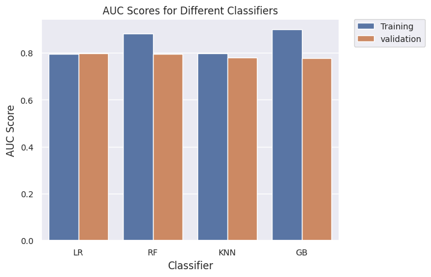
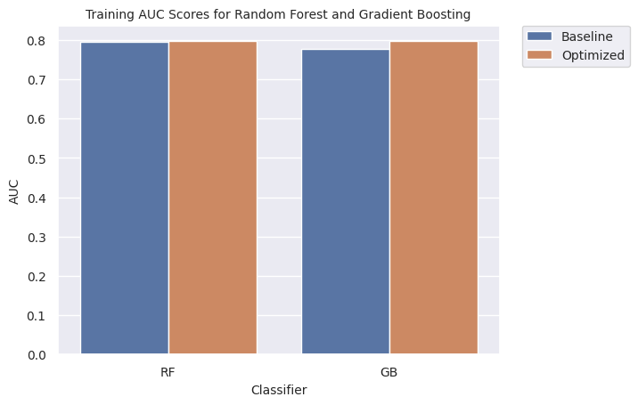
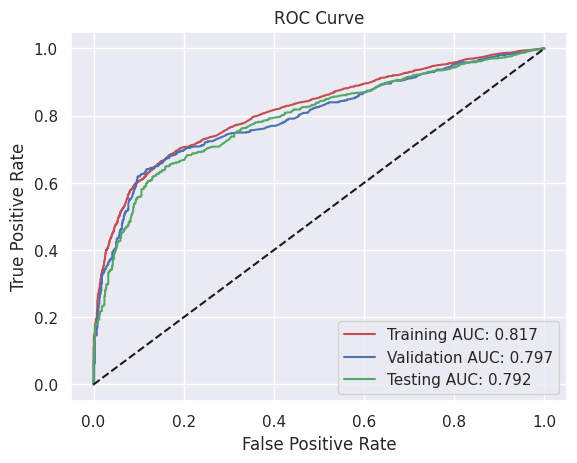

# Bank Marketing using Machine Learning

In this project, we aimed to predict the likelihood of a customer subscribing to a term deposit using various machine learning models. We performed extensive data preprocessing, feature engineering, and model evaluation to achieve our goal. Here are the key steps and findings:

## 1. Exploratory Data Analysis (EDA)
The EDA process involved analyzing the dataset to understand its structure, identify patterns, and detect any anomalies or missing values. Key findings from the EDA include:
- The dataset contains 41,188 entries with 20 original features.
- The target variable is `Y_LABEL`, indicating whether a customer subscribed to a term deposit.
- Several categorical features, such as `job`, `marital`, `education`, etc., were identified.
- Numerical features include `age`, `campaign`, `pdays`, `previous`, etc.
- Missing values were present in some columns, which were handled during the feature engineering phase.

## 2. Feature Engineering
Feature engineering steps included:
- Encoding categorical variables using one-hot encoding to convert them into numerical format.
- Handling missing values by filling them with the mean of the respective columns.
- Scaling numerical features using `StandardScaler` to standardize the data.
- Creating new features by combining existing ones to capture more information.
- Balancing the dataset to ensure an equal representation of both classes in the training, validation, and test sets.

## 3. Model Performances
Several machine learning models were trained and evaluated on the dataset. The models include Logistic Regression, Random Forest Classifier, K-Nearest Neighbors, and Gradient Boosting Classifier. Key performance metrics such as Accuracy, Recall, Precision, Specificity, F1 Score, and AUC were used to evaluate the models.

### Model Comparison

| Model                    | Training AUC | Validation AUC |
|--------------------------|--------------|----------------|
| Logistic Regression      | 0.7966       | 0.7981         |
| Random Forest Classifier | 0.8825       | 0.7950         |
| K-Nearest Neighbors      | 0.7970       | 0.7794         |
| Gradient Boosting        | 0.8996       | 0.7767         |

## 4. Hyperparameter Tuning
Hyperparameter tuning was performed using Randomized Search Cross-Validation for Random Forest and Gradient Boosting models. The optimized models showed improved performance compared to the baseline models.

### Optimization Model Comparison

| Optimized Model          | Training AUC | Validation AUC |
|--------------------------|--------------|----------------|
| Random Forest Classifier | 0.8681       | 0.7973         |
| Gradient Boosting        | 0.8167       | 0.7967         |

## 5. Model Selection
The best model was selected based on performance on the validation set. The Gradient Boosting Classifier with optimized hyperparameters was chosen as the final model.

## 6. Model Evaluation
The final model was evaluated on the test set, achieving an AUC of 0.792, indicating good predictive performance.

## 7. Future Improvements
Potential future improvements include:
- Further feature engineering to create more informative features.
- Exploring additional machine learning models and ensemble methods.
- Implementing advanced techniques such as deep learning for better performance.
- Conducting more extensive hyperparameter tuning.
- Deploying the model for real-time predictions and continuously monitoring its performance.

## 8. Application Integration

Integrating a machine learning model into a real-world application involves several steps. Here's a high-level overview of the process:

1. **Model Training and Validation**:
   - **Data Collection**: Gather and preprocess the data relevant to the problem you're solving.
   - **Model Selection**: Choose an appropriate machine learning algorithm.
   - **Training**: Train the model using the collected data.
   - **Validation**: Validate the model to ensure it performs well on unseen data.

2. **Model Serialization**:
   - **Save the Model**: Serialize the trained model using libraries like `pickle` or `joblib` in Python. This allows you to save the model to disk and load it later without retraining.

3. **Model Deployment**:
   - **Choose a Deployment Environment**: Decide where the model will run (e.g., cloud service, on-premises server, edge device).
   - **Create an API**: Develop a RESTful API using frameworks like Flask or FastAPI to serve the model. This API will handle incoming requests, pass data to the model, and return predictions.

4. **Integration with Frontend**:
   - **Frontend Development**: Develop a frontend application (web or mobile) that interacts with the API. This could be done using frameworks like React, Angular, or Vue.js for web applications, or Swift/Kotlin for mobile applications.
   - **API Calls**: Implement API calls in the frontend to send user input to the backend and display the model's predictions.

5. **Monitoring and Maintenance**:
   - **Monitor Performance**: Continuously monitor the model's performance in the real world to ensure it remains accurate and relevant.
   - **Update Model**: Periodically retrain and update the model with new data to maintain its performance.